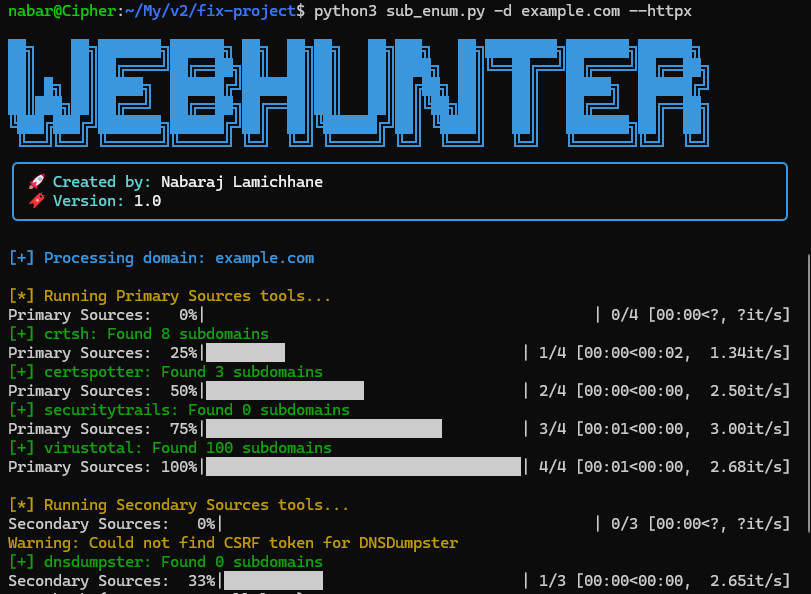

<div align="center">


# 👑 Subdomain Hunter

[](https://github.com/knobrazz/sub_enum)
[](LICENSE)
[](https://www.python.org)
[](https://github.com/knobrazz/sub_enum)

<p align="center">
    <em>🚀 The Ultimate Professional-Grade Subdomain Enumeration & Reconnaissance Suite</em>
</p>

[📚 Documentation](https://github.com/knobrazz/sub_enum/wiki) •
[🚀 Quick Start](#-quick-start) •
[💫 Features](#-features) •
[📊 Examples](#-examples) •
[📜 License](#-license)

---


</div>

## 🎯 Overview

WebHunter Elite Pro is an advanced reconnaissance platform designed for security professionals, penetration testers, and bug bounty hunters. Leveraging cutting-edge technologies and premium APIs, it delivers unparalleled subdomain enumeration capabilities.

<div align="center">

### ✨ Key Highlights

| 🔍 Discovery | 🚀 Performance | 🛡️ Security |
|-------------|----------------|-------------|
| Multi-source Intel | Multi-threaded | Rate Limited |
| Active & Passive | Resource Optimized | API Protected |
| Premium APIs | Real-time Analysis | Proxy Support |
| Custom Wordlists | Smart Caching | Error Handling |

</div>

## 💫 Features

<details open>
<summary><b>🔍 Advanced Discovery Engine</b></summary>

### Passive Reconnaissance
- 📜 Certificate Transparency Analysis
- 🌐 DNS Intelligence Gathering
- 🎯 OSINT Data Integration
- 🔌 Premium API Services

### Active Enumeration
- 🔨 Smart DNS Brute Force
- 🔄 Zone Transfer Detection
- 🎪 Virtual Host Discovery
- 🎯 Wildcard Analysis
</details>

<details open>
<summary><b>🚀 Enterprise Performance</b></summary>

- ⚡ Optimized Multi-threading
- 🔄 Intelligent Rate Limiting
- 🛡️ Resource Management
- 📊 Real-time Analytics
</details>

## 🚀 Quick Start

<details open>
<summary><b>⚙️ Installation</b></summary>

```bash
# Clone Repository
git clone https://github.com/knobrazz/sub_enum.git

# Setup Environment
cd sub_enum
pip install -r requirements.txt
```

<details open>
<summary><b>📊 Professional Output</b></summary>

- 📝 Multiple Export Formats
- 📋 Executive Summary Reports
- 📁 Organized Output Structure
- 📈 Real-time Progress Analytics
</details>

## 💫 Installation

<details open>
<summary><b>⚙️ System Requirements</b></summary>

```yaml
Core Requirements:
  - Python: "≥ 3.8"
  - RAM: "≥ 4GB"
  - Storage: "≥ 1GB"

Optional Tools:
  - Git: "Latest Version"
  - Visual Studio Code: "Recommended IDE"
```

## 📸 Screenshots & Examples

<details open>
<summary><b>🖼️ Tool Demonstration</b></summary>

<div align="center">

### Basic Scan Example


### Advanced Features Demo


</div>
</details>

## ⚠️ Caution & Disclaimer

<div align="center">

```plaintext
🚨 IMPORTANT SECURITY NOTICE 🚨

This tool is intended for AUTHORIZED SECURITY TESTING ONLY.
Unauthorized use against systems you don't own or have permission 
to test is STRICTLY PROHIBITED and may violate applicable laws.
```

